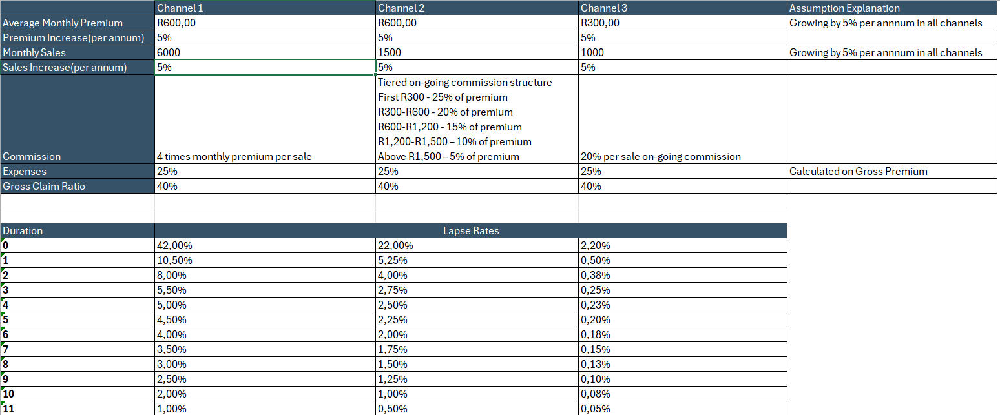

## 📖 Overview
In this project I develops a 5-year financial forecast for a fictitious insurance startup to evaluate how different commission structures impact profitability, cash flow, and financial risk.

The model compares **three sales channels** with distinct commission strategies to answer key business questions:

- How do upfront vs. recurring commission models affect profitability?
- What are the liquidity risks during early-stage growth?
- How can channel mix optimize both short-term cash flow and long-term margins?

---
## ⚙️ Methodology
The model is built using a bottom-up modeling approach, focusing on monthly policy behavior to drive total portfolio results.

**Step 1: Cohort construction**
 - Created a 60-months cohort table to track policies from acquisition throught to maturity.
 - Each cohort represent a monthly batch of new policies.
 - Active policies at each month were calculated as prior period policies adjusted for lapses.
 
**Step 2: Revenue And Cost Drivers**
 Derived key financial metrics using insurance industry definitions foe example: Gross premium = Active policies* monthly premium.
 
 **Step 3: Channel Level Modeling**
 Modeled all 3 sales channels independently, each with:
 - Channel sales- Cohort tables are built in these tabs.
 - Channel calculations - 60 months of income statements are calculated on these tabs.

Step 4: Financial Statements Consolidation

 - Converted monthly outputs into the 5-year income statement in the summary tab.
 - Built the cummulative Net Cashflow curve(J-curve to assess profitability  and capital recovery timing) in the visuals tab.
 - Built the Annual Revenue Vs Net Profit graph to assess margin expansion in the visual tab.

Key assumptions:

