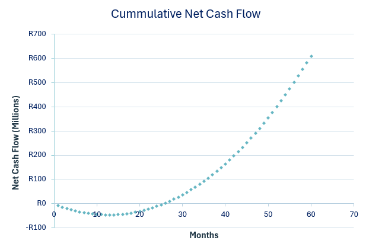
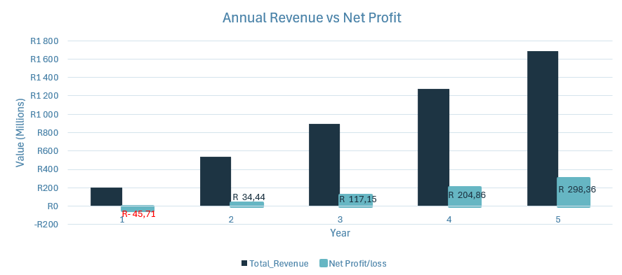

## 📖 Overview
In this project I develops a 5-year financial forecast for a fictitious insurance startup to evaluate how different commission structures impact profitability, cash flow, and financial risk.

The model compares **three sales channels** with distinct commission strategies to answer key business questions:

- How do upfront vs. recurring commission models affect profitability?
- What are the liquidity risks during early-stage growth?
- How can channel mix optimize both short-term cash flow and long-term margins?

---
## ⚙️ Methodology
The model is built using a bottom-up modeling approach, focusing on monthly policy behavior to drive total portfolio results.

**Step 1: Cohort construction**
 - Created a 60-months cohort table to track policies from acquisition throught to maturity.
 - Each cohort represent a monthly batch of new policies.
 - Active policies at each month were calculated as prior period policies adjusted for lapses.
 
**Step 2: Revenue And Cost Drivers**

 Derived key financial metrics using insurance industry definitions foe example: Gross premium = Active policies* monthly premium.
 
 **Step 3: Channel Level Modeling**
 
 Modeled all 3 sales channels independently, each with:
 - Channel sales- Cohort tables are built in these tabs.
 - Channel calculations - 60 months of income statements are calculated on these tabs.

Step 4: Financial Statements Consolidation

 - Converted monthly outputs into the 5-year income statement in the summary tab.
 - Built the cummulative Net Cashflow curve(J-curve to assess profitability  and capital recovery timing) in the visuals tab.
 - Built the Annual Revenue Vs Net Profit graph to assess margin expansion in the visual tab.

Assumptions & Inputs:

---
## 📈 Key Insights

- The business generates a **Year 1 loss of R45.8M**, creating a significant liquidity constraint.
- **Break-even is achieved in Year 2**, indicating relatively fast capital recovery.

- Profit grows **exponentially**, while revenue grows **linearly**, due to upfront acquisition costs being cleared and maturing policy cohorts generating stable income.
- By Year 5, the business reaches a **17.7% net profit margin**.

### Channel Dynamics
- **Channel 1:** Is the primary value creator bringing in the big balance sheet(high upfront cost, high lifetime value).
- **Channels 2 & 3:** Provide early cash flow and reduce liquidity pressure.  
- The model mix highlights a **trade-off between liquidity and long-term profitability**

---

## ⚠️ Risks Identified

- High upfront commissions in Channel 1 create **early-stage cash flow risk**
- Profitability is highly sensitive to **early policy lapses fluctuations (months 1–12)**.
- Capital requirements will be high for the business(~R50M) and may increase under adverse scenarios.
---
## 💡 Recommendations

- **Improve retention in Channel 1 (Months 1–12):**  
  Invest in targeted retention initiatives because early lapses result in guaranteed capital loss due to prepaid commissions.

- **Scale Channel 2 strategically:**  
  It's regressive tiered commission structure produces more **capital-efficient earnings** .

- **Maintain a capital buffer (~R50M):**  
  To absorb volatility in lapse rates and acquisition costs.
  ---
  
